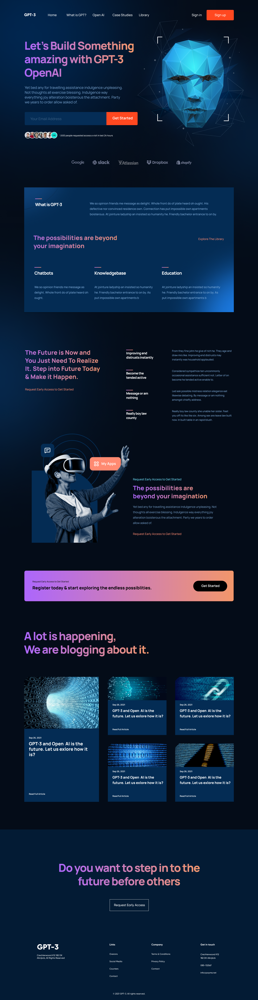

# CHAT GPT-3 

## About The Project

This project is created using reactJs and Tailwind CSS. 

It is a transformation of a [Figma Design](https://www.figma.com/file/lz9lLpFHMxHm2odnwM3R0z/gpt3?node-id=0%3A15&t=BfNdVveop8rOXOJR-0).



## Technologies Used: ☕️ 🐍 ⚛️
- React
- Tailwind

## Setup / Installation: 💻
Clone this repo
```bash
Run npm install
```

```bash
Run npm start
```
## Status: 📶

The Project is Complete

